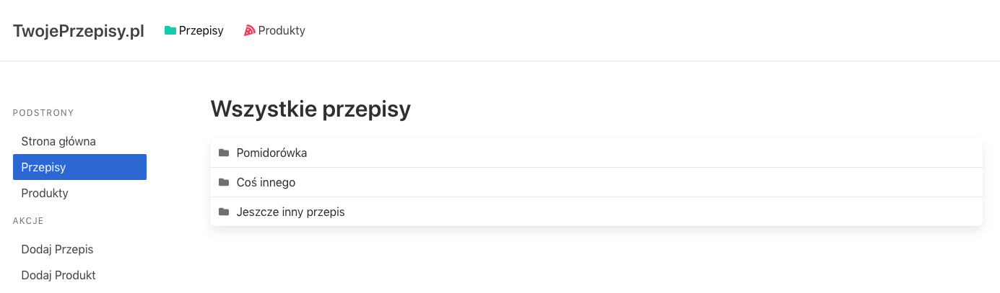
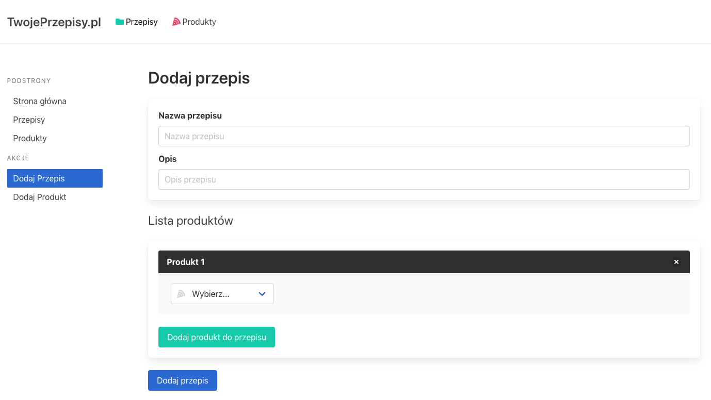
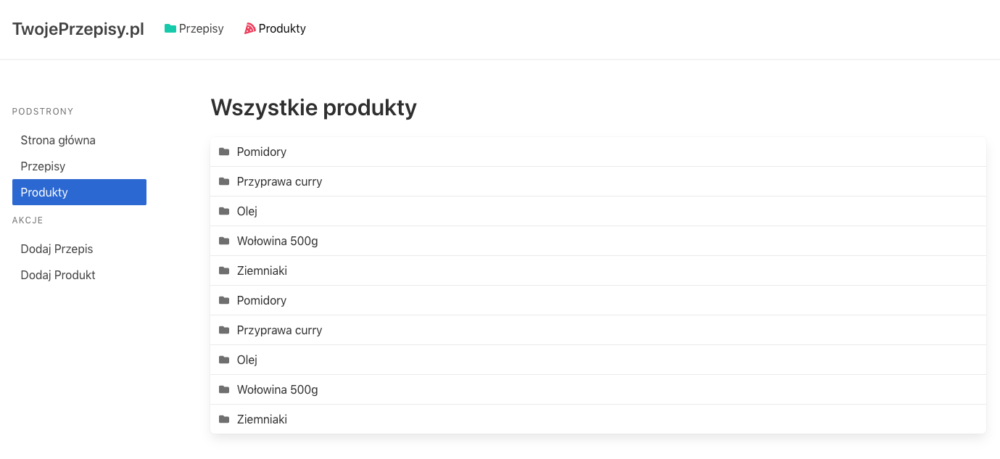
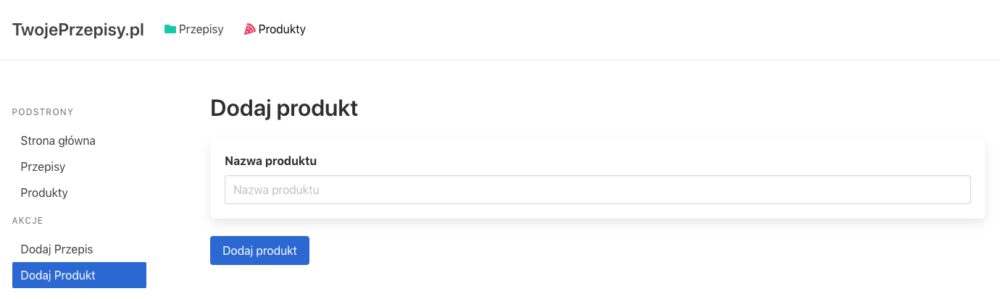
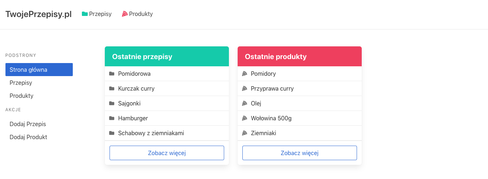

# Redux Zaawansowany

## Przygotowanie
> Zmodyfikujcie plik `webpack.config.js`, tak aby:
> - zmienna `entryPath` wskazywała na `1_Zadania/Tydzien_2_Dzien_4/2_redux_zaawansowany`
> - zmienna `entryFile` wskazywała na plik, nad którym aktualnie pracujecie, np. `index.js`
>
> **Pamiętajcie, aby po każdej zmianie w pliku `webpack.config.js` przerwać działanie Webpacka (`CTRL+C`) a następnie włączyć go z powrotem (`npm start`).**
Zainstaluj paczkę `prop-types`. Następnie w pliku `User.js` zaimplementuj komponent, który będzie wyświetlał informacje o użytkowniku.

## Zadanie do wykonania z wykładowcą

Zaimplementuj aplikację składającą się z 2 podstawowych typów danych:

## Przepisy



* `/recipes` - wyświetlamy wszystkie dostępne przepisy w naszym `store`. Każdy przepis kieruje do miejsca w którym możemy podejrzeć treść tego przepisu, np. `/recipes/1` gdzie `1` to `id` przepisu.



* `/recipes/add` - strona pozwalająca dodawać nowe przepisy. Aby dodać przepis musimy mieć dodane jakieś produkty. Nie powinno być możliwości dodać przepisu bez produktów.


## Produkty



* `/products` - strona wyświetlająca wszystkie produkty. Również kierują one do miejsc w których możemy je podejrzeć, np. `/products/1`.




* `/products/add` - strona pozwalająca dodać produkt do store.


# Strona główna


Składa się z linków nawigacyjnych, a także dwóch paneli z ostatnimi przepisami i ostatnimi produktami. W nich mają znaleźć się **tylko i wyłącznie 5 ostatnich przepisów i produktów!**


---

# Specyfikacja

W aplikacji mamy mieć możliwość dodawania produktów i przepisów.

Opiera się na ścieżkowaniu `react-router` które trzeba odpowiednio zapisać zgodnie z wyżej wymienionymi ścieżkami.

Wszystko powinno opierać się na architekturze Redux. Przepisy i produkty powinny mieć osobne reducery połączone za pomocą `combinedReducers`. Akcje również powinny być odseparowane w osobnych plikach.

Większość konstrukcji prezentacyjnej jest wykonana. Jeżeli czas na to pozwoli, należy zrobić również komponent prezentacyjny dla **indywidualnego** przepisu czy produktu (opcjonalne).

Wszystkie komponenty prezentacyjne są w katalogu `components`:

- `Home`: zawiera pliki `LastProducts` i `LastRecipes` odpowiedzialne za dwie kolumny na stronie głównej

- `Products`: zawiera pliki odpowiedzialne za podstrony `/products` i `/products/add`.

- `Recipes`: zawiera pliki odpowiedzialne za podstrony `/recipes` i `/recipes/add`.

Do zrobienia pozostało:

- komponenty kontenerowe
- React Router
- Redux

Aby aplikacja miała poprawny wygląd, to w pliku `App.js` zaraz po nastawieniu `Providera` dla naszego `store` a także ustawieniu `Router'a` należy umieścić komponent `Layout`:

```js
<Provider>
  <Router>
    <Layout>
      {// Reszta contentu }
    </Layout>
  </Router>
</Provider>
```
